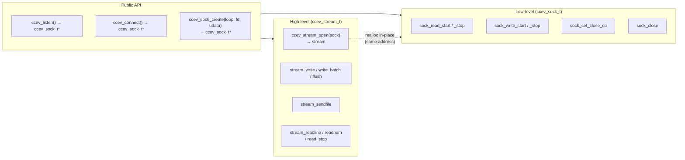
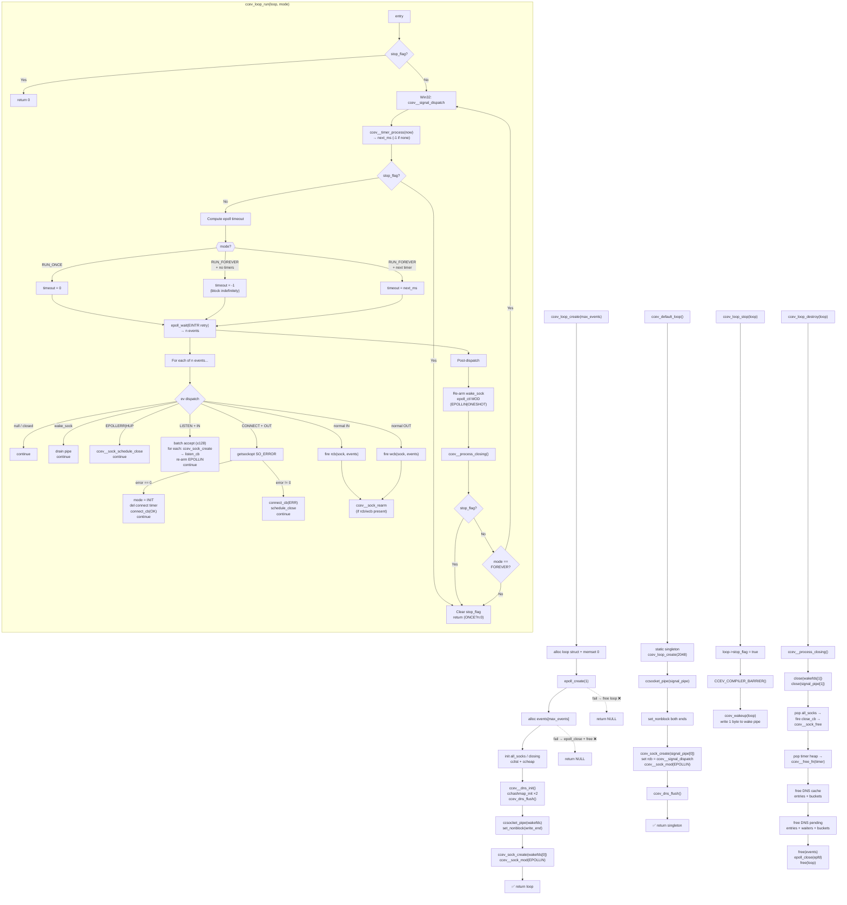
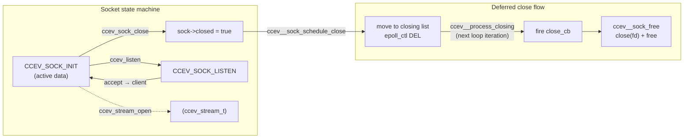

# AGENTS.md — ccev

> AI coding agent guide for the ccev project.

## Project identity

**ccev** — A lightweight, cross-platform reactor event-driven library.

- Language: C99
- Build: CMake ≥ 3.10
- License: MIT
- Author: CandyMi

## Dependencies (git submodules)

| Dep | Type | Repository | Purpose |
|---|---|---|---|
| epoll | Compiled (1 backend per platform) | CandyMi/epoll | Cross-platform epoll ABI |
| ccalg | Header-only | CandyMi/ccalg | Intrusive data structures |
| ccsocket | Compiled | CandyMi/ccsocket | Cross-platform socket API |

Submodules must be initialized before building.
CMake will print a clear error if they are missing.

## Source files

| File | Role |
|---|---|
| src/ccev.h | Public API (Doxygen) |
| src/ccev_internal.h | Internal structures |
| src/ccev.c | Reactor core (loop, listen, connect, dispatch) |
| src/ccev_sock.c | Socket lifecycle (create, close, epoll registration) |
| src/ccev_stream.c | Buffered I/O, write/read/sendfile state machines |
| src/ccev_timer.c | Timer subsystem (4-ary heap) |
| src/ccev_dns.c | Async DNS resolver |
| src/ccev_icmp.c | ICMP echo (ping) |
| src/ccev_signal.c | Signal handling (self-pipe trick) |

## CI pipeline (`.github/workflows/ci.yml`)

| Job | OS | Arch | Compiler | Sanitizer |
|---|---|---|---|---|
| linux-gcc | Ubuntu | x86_64 | GCC | ASAN+UBSAN |
| linux-clang | Ubuntu | x86_64 | Clang | ASAN+UBSAN |
| linux-32bit | Ubuntu | i686 | GCC (-m32) | — |
| macos-arm64 | macOS | arm64 | AppleClang | ASAN+UBSAN |
| windows-msvc-x64 | Windows | x64 | MSVC | — |
| windows-msvc-x86 | Windows | x86 | MSVC | — |
| windows-mingw64 | Windows | x64 | MinGW-w64 (GCC) | — |
| windows-mingw32 | Windows | x86 | MinGW-w64 (GCC) | — |
| windows-clangcl | Windows | x64 | ClangCL (VS 2022) | — |

### File-content congruence

Every public symbol MUST be defined in the file whose name matches its
primary responsibility:

| Symbol | File | Reason |
|--------|------|--------|
| `ccev_loop_create/destroy/run/stop`, `ccev_listen`, `ccev_connect`, `ccev_default_loop` | `ccev.c` | Core reactor lifecycle |
| `ccev_sock_create/close/read_start/stop/write_start/stop/set_close_cb/get_fd/get_udata/set_udata/count` | `ccev_sock.c` | Socket lifecycle + epoll management |
| `ccev_stream_open/close/write/write_batch/flush/sendfile/readline/readnum/read_stop/set_send_cb/set_close_cb/wbuf_len` | `ccev_stream.c` | Buffered I/O + stream reader |
| `ccev_timer_add/del/reset` | `ccev_timer.c` | Timer subsystem |
| `ccev_dns_*` | `ccev_dns.c` | DNS resolver |
| `ccev_icmp_echo` | `ccev_icmp.c` | ICMP echo |
| `ccev_signal_handle/ignore` | `ccev_signal.c` | Signal handling |

Do NOT put functions in `ccev.c` that belong to a sub-module, and vice
versa.  When a sub-module needs read-access to a core primitive (e.g.
`ccev__g_default_loop`), declare it `extern` in `ccev_internal.h`.

## Architecture — two-level socket abstraction



## Reactor loop lifecycle



The reactor loop runs in `ccev_loop_run()`:

1. **Phase 0** (Win32 only): Poll the `sig_pending` flag — Windows signal delivery.
2. **Phase 1 — Timers**: `ccev__timer_process()` pops expired timers from the 4-ary heap and fires their callbacks before any I/O dispatch. Returns `ms` until the next future timer, or `-1` if none remain.
3. **Phase 2 — Timeout**: Choose epoll timeout — `0` for RUN_ONCE, `-1` (block) when no timers, or the precise `next_ms` to meet the earliest timer.
4. **Phase 3 — Poll**: `epoll_wait()` with EINTR retry. Returns `n` ready events.
5. **Phase 4 — Dispatch**: For each event, route by socket mode:
   - `wake_sock`: Drain the pipe, skip re-arm (handled post-loop).
   - `HUP/ERR`: Immediate deferred close — no user callback.
   - `LISTEN + EPOLLIN`: Batch accept up to `CCEV_MAX_ACCEPT_BATCH` (128), wrap each in `ccev_sock_t`, fire `listen_cb`, then re-arm listener.
   - `CONNECT + EPOLLOUT`: Connect completion — `getsockopt(SO_ERROR)`. Zero → transition to `CCEV_SOCK_INIT`, fire `connect_cb(OK)`. Non-zero → fire `connect_cb(ERR)`, schedule close.
   - Normal `EPOLLIN`/`EPOLLOUT`: Fire `rcb`/`wcb`, then re-arm via `ccev__sock_rearm()` (re-registers ONESHOT for whichever callbacks are still set).
6. **Phase 5**: Unconditionally re-arm `wake_sock` (`epoll_ctl MOD`, EPOLLIN|ONESHOT) — even if no wakeup fired, this is a harmless no-op refresh.
7. **Phase 6**: `ccev__process_closing()` — fire `close_cb` and free every socket in the closing list.
8. Check `stop_flag` — break if set, or loop if `CCEV_RUN_FOREVER`.



## Coding conventions

### Language

- **C99** (`-std=c99`). No C11/GNU features in public API surface.
- Public headers wrapped in `extern "C" { }`.
- All documentation in **English** (source comments, Doxygen, docs, git commits).

### Naming

| Category | Pattern | Example |
|---|---|---|
| Public functions | `ccev_verb_noun` | `ccev_loop_create`, `ccev_sock_close` |
| Internal functions | `ccev__verb_noun` | `ccev__sock_rearm` |
| Internal static | `_verb_noun` | `_reader_dispatch` |
| Types (opaque) | `ccev_xxx_t` | `ccev_loop_t`, `ccev_sock_t`, `ccev_stream_t` |
| Enumerations | `CCEV_UPPER_SNAKE` | `CCEV_RUN_FOREVER` |
| Constants | `CCEV_UPPER_SNAKE` | `CCEV_OK`, `CCEV_ERR` |
| Event flags | `CCEV_EVENT_UPPER` | `CCEV_EVENT_READ`, `CCEV_EVENT_HUP` |

### Comment style

- **Use `/* */` throughout each file.** Do NOT mix `/* */` and `//` in the same file.
- Public API declarations in `.h` files MUST have Doxygen `/** @brief … @param … @return … */`.
- Every fixed or added feature MUST update its Doxygen comment.
- Internal functions may use plain `/* brief */`.

### Headers / Include style

Follow ccsocket conventions:

- System/platform headers (`<...>`) before project headers (`"..."`).
- `#include` shall be minimal — do not include what you do not use.
- `<string.h>` is provided by `ccev_internal.h` — do NOT include it in `.c` files.
- Use `#if defined(_WIN32)` for Windows and `#else` for POSIX. No `__linux__` in public headers.

### Memory management

- All internal allocations use `loop->realloc_fn` / `loop->free_fn` (replaceable).
- Timers: lazy deletion via `active=false`. Freed when popped from heap.
- Sockets: deferred close via closing list, freed after all callbacks return.
- **DRY rule**: if you free the same struct type in more than one place, extract a `static void _xxx_free(loop, ptr)` helper.

### Error handling

- Return `CCEV_OK(0)` on success, `CCEV_ERR(-1)` on failure.
- All public functions MUST guard NULL parameters at entry.
- No `assert()`, no `abort()` in public functions.
- Closed sockets: all I/O returns `CCEV_ERR` immediately.

### Code reuse rules

1. Every teardown/destroy pattern that appears more than once MUST be a named function.
2. Every socket-fallback pattern (IPv4→IPv6) MUST be a shared helper.
3. `ccev__sock_free()` is the single free path for all sockets — never free a `ccev_sock_t` manually.

## Git conventions

Use **Conventional Commits** (English only):

```
<type>(<scope>): <short summary> (≤ 72 chars)

[optional body — wrap at 72 chars]
```

### Allowed types

`feat`, `fix`, `refactor`, `docs`, `test`, `bench`, `build`, `ci`, `chore`.

### Scope

Scope is the affected module: `core`, `timer`, `sock`, `stream`, `dns`, `icmp`, `build`, `docs`, `tests`, `ci`.

### Commit checklist

1. [ ] Build passes with zero warnings
2. [ ] All tests pass (`ctest --test-dir build`)
3. [ ] Doxygen comments updated for any changed public API
4. [ ] AGENTS.md / docs/ synced
5. [ ] No duplicated code — any repeated destructor or fallback pattern extracted

## Testing rules

1. Every public API function MUST have at least one test in `tests/`.
2. Every NULL-param guard MUST be tested (call with NULL, expect `CCEV_ERR`).
3. Every "fd closed" path MUST be tested (call after close, expect `CCEV_ERR`).
4. `ccev_stream_write` and `ccev_stream_write_batch` must test both with and without per-buffer callback.
5. `ccev_stream_readline` and `ccev_stream_readnum` must test timeout expiration.
6. `ccev_listen` + `ccev_connect` must have an end-to-end TCP test.
7. Error-return paths (OOM, create failure) should have a test for each distinct error code.
8. Tests MUST use the unified TEST/ASSERT/RUN macros (see test_timer.c).
