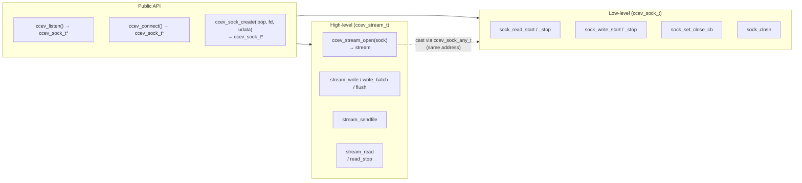
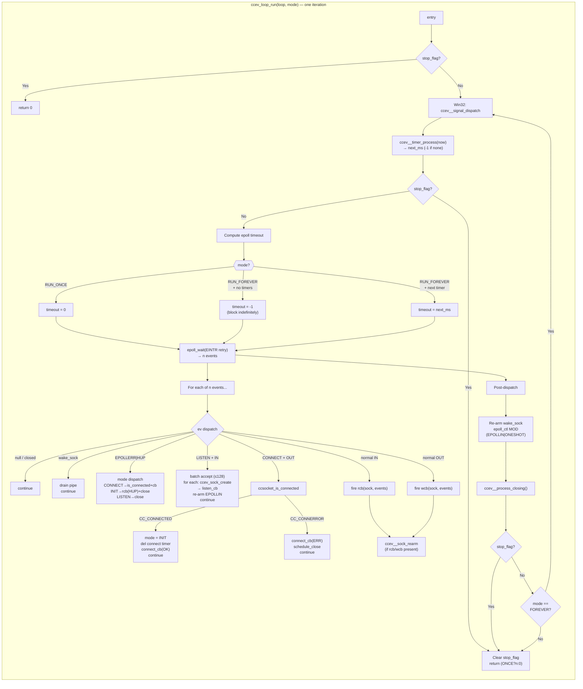
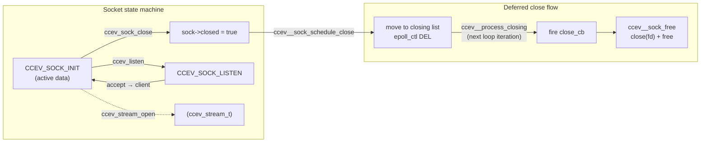

# ccev

[](https://github.com/CandyMi/ccev/actions)
[](LICENSE)
[](https://en.wikipedia.org/wiki/C99)
[]()

A lightweight, cross-platform reactor event-driven library written in C99.

## Build

```bash
git clone --recurse-submodules https://github.com/CandyMi/ccev.git
cd ccev
cmake -B build
cmake --build build
ctest --test-dir build --output-on-failure
```

## Two-level API

ccev provides two levels of socket abstraction:

- **`ccev_sock_t`** — raw fd + event callbacks (reactor primitive).  
  Create via `ccev_sock_create()`, `ccev_listen()`, or `ccev_connect()`.  
  Register interest with `ccev_sock_read_start()` / `ccev_sock_write_start()`.

- **`ccev_stream_t`** — buffered I/O + stream reader (protocol primitive).  
  Upgrade a sock via `ccev_stream_open()` (same address, backed by `ccev_sock_any_t`).  
  Provides `ccev_stream_write()`, `ccev_stream_read()`, `ccev_stream_sendfile()`.



## Reactor loop lifecycle





### Lifecycle phases

1. **Phase 0** (Win32): Poll `sig_pending` flag.
2. **Phase 1 — Timers**: `ccev__timer_process()` pops expired timers from the 4-ary heap and fires callbacks before I/O dispatch.
3. **Phase 2 — Timeout**: 0 for RUN_ONCE, -1 (block) when no timers, or `next_ms` to meet the earliest timer.
4. **Phase 3 — Poll**: `epoll_wait()` with EINTR retry.
5. **Phase 4 — Dispatch**: Route each event by socket mode:
   - `wake_sock`: drain pipe, skip re-arm.
   - `HUP/ERR`: Mode-based dispatch — CONNECT→`ccsocket_is_connected`+`connect_cb`, INIT→`rcb(HUP)`+close, LISTEN→close.
   - `LISTEN`: batch accept (≤128), fire `listen_cb` per client, re-arm.
   - `CONNECT`: `ccsocket_is_connected()` — `CC_CONNECTED`→OK, `CC_CONNERROR`→ERR+close.
   - Normal I/O: fire `rcb`/`wcb`, then `ccev__sock_rearm()`.
6. **Phase 5**: Unconditionally re-arm `wake_sock` (`epoll_ctl MOD`, EPOLLIN|ONESHOT).
7. **Phase 6**: `ccev__process_closing()` — fire `close_cb` and free.
8. Check `stop_flag`: break if set, loop if `CCEV_RUN_FOREVER`.

## Quick start — echo server

```c
#include "ccev.h"
#include <stdio.h>
#include <string.h>

/* Forward declarations */
static void on_readable(ccev_sock_t *sock, int events);

static void on_sent(void *udata) { (void)udata; }

static void on_readable(ccev_sock_t *sock, int events) {
    (void)events;
    char buf[4096];
    int n;
    ccsocket_stcode_t rc = ccsocket_recv(ccev_sock_get_fd(sock),
                                          buf, sizeof(buf), &n);
    if (rc == CC_OPCODE_OK && n > 0) {
        ccev_stream_t *st = (ccev_stream_t *)ccev_sock_get_udata(sock);
        ccev_stream_write(st, buf, (size_t)n, on_sent, NULL);
    } else if (rc == CC_OPCODE_ERROR && n == 0) {
        ccev_sock_close(sock);
    }
}

static void on_accept(void *udata, ccev_sock_t *client,
                       const char *ip, int port) {
    printf("accept: %s:%d\n", ip, port);
    /* Upgrade to stream for buffered write */
    ccev_stream_t *st = ccev_stream_open(client);
    ccev_sock_set_udata(client, st);
    ccev_sock_read_start(client, on_readable);
}

int main(void) {
    ccev_loop_t *loop = ccev_loop_create(1024);
    if (!loop) return 1;

    ccev_sock_t *listener = ccev_listen(loop, "0.0.0.0", 8080, 128,
                                         CCEV_REUSEADDR, on_accept, NULL);
    if (!listener) { ccev_loop_destroy(loop); return 1; }

    printf("echo server on 0.0.0.0:8080\n");
    ccev_loop_run(loop, CCEV_RUN_FOREVER);
    ccev_loop_destroy(loop);
    return 0;
}
```

See [docs/](docs/) for full documentation.

## License

MIT
