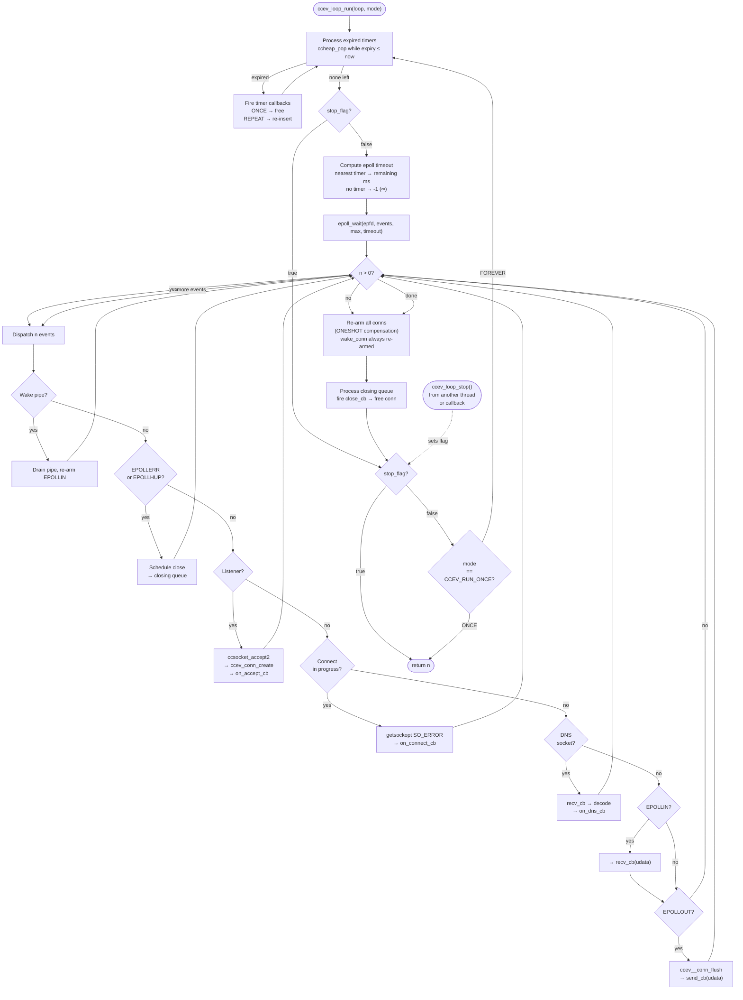

# ccev

A lightweight, cross-platform reactor event-driven library written in C99.

## Prerequisites

- C compiler (GCC, Clang, MSVC, MinGW) — C99 support required
- CMake ≥ 3.0
- git (for submodule initialization)

## Build

```bash
# 1. Clone with submodules
git clone --recurse-submodules https://github.com/CandyMi/ccev.git
cd ccev

# (If you already cloned without --recurse-submodules:)
# git submodule update --init --recursive

# 2. Build
cmake -B build
cmake --build build

# 3. Test
ctest --test-dir build --output-on-failure
```

## Dependencies

ccev uses three git submodules, all authored by [CandyMi](https://github.com/CandyMi):

| Dependency | Repository | License |
|---|---|---|
| epoll | [CandyMi/epoll](https://github.com/CandyMi/epoll) | MIT |
| ccalg | [CandyMi/ccalg](https://github.com/CandyMi/ccalg) | BSD-3 |
| ccsocket | [CandyMi/ccsocket](https://github.com/CandyMi/ccsocket) | MIT |

To switch to a fork, edit `.gitmodules` and run:

```bash
scripts\init-deps.cmd (Windows) / scripts/init-deps.sh (POSIX)
```

## Reactor loop lifecycle

```
ccev_loop_run(loop, mode)
  |
  +-- 1. Process expired timers (ccheap_pop --> callbacks)
  |       ONCE --> free, REPEAT --> re-insert
  |
  +-- 2. Check stop_flag (from ccev_loop_stop)
  |
  +-- 3. Compute epoll_wait timeout
  |       nearest timer --> remaining ms
  |       no timer      --> -1 (infinite)
  |
  +-- 4. epoll_wait(epfd, events, max_events, timeout)
  |
  +-- 5. Dispatch n fired events:
  |       [wake pipe]    drain + re-arm EPOLLIN
  |       [EPOLLERR/HUP] schedule close --> closing queue
  |       [listener]     accept2 --> conn_create --> on_accept_cb
  |       [connecting]   getsockopt SO_ERROR --> on_connect_cb
  |       [DNS socket]   recv --> decode --> on_dns_cb
  |       [EPOLLIN]      recv_cb(udata)
  |       [EPOLLOUT]     flush write buffer --> send_cb(udata)
  |
  +-- 6. Re-arm all connections (ONESHOT compensation)
  |       wake_conn always re-armed
  |
  +-- 7. Process closing queue
  |       close_cb(udata) --> free conn
  |
  +-- 8. stop_flag set? --> return
  |       mode == ONCE    --> return
  |       FOREVER         --> goto 1
```



## Quick start

```c
#include "ccev.h"
#include <stdio.h>
#include <string.h>

static void on_sent(void *udata) { (void)udata; }
static void on_recv(void *udata) {
    ccev_conn_t *conn = (ccev_conn_t *)udata;
    char buf[4096];
    int n;
    for (;;) {
        n = ccev_conn_recv(conn, buf, sizeof(buf), NULL, NULL);
        if (n > 0) ccev_conn_send(conn, buf, (size_t)n, on_sent, NULL);
        else return;
    }
}
static void on_close(void *udata) { ccev_conn_close((ccev_conn_t*)udata); }
static void on_accept(void *udata, ccev_conn_t *conn,
                       const char *ip, int port) {
    printf("accept: %s:%d\n", ip, port);
    ccev_conn_set_close_cb(conn, on_close, conn);
    ccev_conn_recv(conn, NULL, 0, on_recv, conn);
}

int main(void) {
    ccev_loop_t *loop = ccev_loop_create(1024);
    ccev_listen(loop, "0.0.0.0", "8080", 128, CCEV_REUSEADDR, on_accept, NULL);
    ccev_loop_run(loop, CCEV_RUN_FOREVER);
    ccev_loop_destroy(loop);
    return 0;
}
```

See [docs/getting-started.md](docs/getting-started.md) and [docs/api-reference.md](docs/api-reference.md) for full documentation.

## License

MIT
