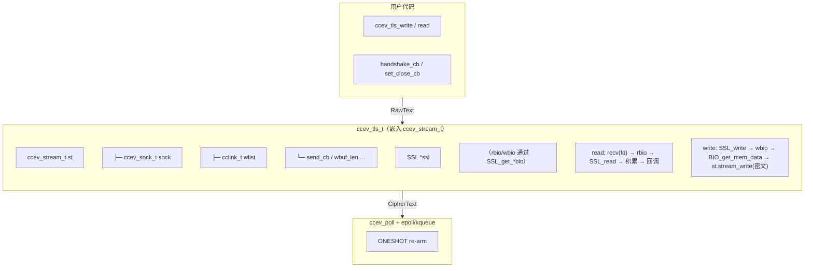
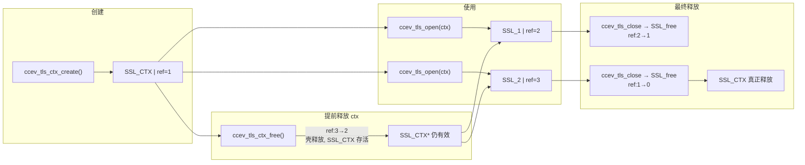

# TLS 集成设计文档

> ccev — 基于 OpenSSL Memory BIO 的 TLS 实现方案
>
> `ccev_tls_t` 嵌入 `ccev_stream_t` 作为首字段，复用写缓冲机制。
> `SSL_CTX` 完全封装为不透明句柄，对外零 OpenSSL 头文件依赖。

---

## 1. 架构位置

`ccev_tls_t` 嵌入 `ccev_stream_t` 作为第一字段，通过 `ccev_sock_any_t` 联合体与 `ccev_sock_t` 共享内存。用户只感知两层抽象：**`ccev_sock_t`（传输层）** 和 **`ccev_tls_t`（加密层）**，中间的 `ccev_stream_t` 完全封装在内部。



### 内存布局

```c
union ccev_sock_any_t {
    ccev_sock_t        sock;
    ccev_stream_t      stream;
    ccev_listener_t    listener;
    ccev_connector_t   connector;
    ccev_tls_t         tls;       // ← 新增
};
```

`ccev_tls_t` 和 `ccev_sock_t`/`ccev_stream_t` 共享同一块内存，`ccev__sock_free` 释放联合体时自动释放 TLS，无需独立的 closing 列表或 deferred free。

---

## 2. 为什么选择 Memory BIO 而非 `SSL_set_fd`

| 对比维度 | `SSL_set_fd` | Memory BIO (选择) |
|---|---|---|
| **数据控制** | OpenSSL 直接读写 fd，ccev 无法拦截 | 明文/密文切换完全由 ccev 控制 |
| **renegotiation** | WANT_READ/WANT_WRITE 交叉，状态机复杂 | 每次 SSL 调用后检查 wbio 即可 |
| **写路径复用** | 需为 SSL 单独实现写缓冲 | 加密后直接 `stream_write(密文)`，复用完整 wlist |
| **可测试性** | 必须起端口、真实证书、真实对端 | 两个 `BIO_s_mem()` 环回，测试零网络依赖 |
| **错误诊断** | 错误在 OpenSSL 内部消化 | rbio/wbio 内容可 dump 调试 |

---

## 3. 文件布局

| 文件 | 角色 | 对外可见 |
|---|---|---|
| `src/ccev_tls.h` | 公共 API 头文件 | ✅ 安装 |
| `src/ccev_tls.c` | TLS 核心实现 | — |
| `src/ccev_tls_ctx.c` | SSL_CTX 封装 | — |
| `src/ccev_tls_internal.h` | 内部结构体（不安装） | ❌ |
| `docs/tls.md` | 本文档 | — |

---

## 4. API 总览

### 4.1 类型与常量

```c
// ccev_tls.h

typedef struct ccev_tls_ctx_s ccev_tls_ctx_t;
typedef struct ccev_tls_s     ccev_tls_t;

typedef enum {
    CCEV_TLS_VERIFY_NONE = 0,
    CCEV_TLS_VERIFY_PEER,               // 默认
} ccev_tls_verify_t;

typedef void (*ccev_tls_handshake_cb)(void *udata, ccev_tls_t *tls, int status);

#define CCEV_TLS_OK         0    // 握手成功
#define CCEV_TLS_ERR_IO    -1    // 网络断开 / 超时
#define CCEV_TLS_ERR_PROTO -2    // 协议错误（版本不匹配）
#define CCEV_TLS_ERR_CERT  -3    // 证书验证失败
#define CCEV_TLS_ERR_SYS   -4    // 资源错误（OOM、SSL_CTX 无效）
```

### 4.2 TLS 上下文管理

```c
/** 创建服务端上下文（加载证书+私钥，用于 accept 场景）。 */
ccev_tls_ctx_t *ccev_tls_ctx_server(const char *cert_file,
                                     const char *key_file);

/** 创建客户端上下文（加载系统 CA，用于 connect 场景）。
 *
 *  如果系统 CA 路径不可用（Windows 上始终如此，POSIX 上也可能
 *  出现——例如 Docker 容器裁剪），返回 NULL。
 *  Windows 用户必须用 ccev_tls_ctx_set_ca_file() 手动指定 CA 包。 */
ccev_tls_ctx_t *ccev_tls_ctx_client(void);

/**
 * CA 文件配置。
 * @param replace  false = 追加到系统默认 CA 之上；true = 只信任指定文件。
 */
int  ccev_tls_ctx_set_ca_file(ccev_tls_ctx_t *ctx,
                               const char *ca_file,
                               bool replace);

int  ccev_tls_ctx_set_verify(ccev_tls_ctx_t *ctx, ccev_tls_verify_t mode);
int  ccev_tls_ctx_set_alpn(ccev_tls_ctx_t *ctx, const char *protos);
int  ccev_tls_ctx_set_ciphers(ccev_tls_ctx_t *ctx, const char *cipher_list);

void ccev_tls_ctx_free(ccev_tls_ctx_t *ctx);
```

### 4.3 TLS 连接 — 三步生命周期

**步骤 1：创建**

```c
/**
 * 创建 TLS 连接对象。
 * 内部初始化 SSL/BIO，不接管 sock->rcb，不启动握手。
 * 返回 sock 地址转型（和 ccev_stream_open 一致）。
 * @param sock  从 ccev_connect / ccev_listen 回调获得的 sock
 * @param ctx   TLS 上下文（角色已在 ctx 中编码）
 */
ccev_tls_t *ccev_tls_open(ccev_sock_t *sock,
                            ccev_tls_ctx_t *ctx);
```

**步骤 2：配置（可选，必须在 handshake 之前调用）**

```c
int ccev_tls_set_servername(ccev_tls_t *tls, const char *hostname);
int ccev_tls_set_alpn(ccev_tls_t *tls, const char *protos);
int ccev_tls_set_ciphers(ccev_tls_t *tls, const char *cipher_list);
```

**步骤 3：启动握手**

```c
/**
 * 启动 TLS 握手。接管 sock->rcb = _tls_on_readable。
 * 回调总是异步（通过 reactor 驱动），即使同步完成也走 next tick。
 * 超时触发后自动 schedule_close。
 * @param timeout_ms  超时毫秒（0 = 不设），类型与现有 ccev API 一致为 int
 * @param cb          握手完成回调
 * @param udata       用户数据
 * @return 0（异步进行中），CCEV_OK（同步完成，罕见），CCEV_ERR
 */
int ccev_tls_handshake(ccev_tls_t *tls,
                        int timeout_ms,
                        ccev_tls_handshake_cb cb,
                        void *udata);
```

**快捷入口（覆盖 80% 场景）**

```c
/**
 * 快捷入口 = ccev_tls_open + set_servername + handshake。
 * 需要自定义配置（ALPN、cipher 等）请走三步流程。
 */
ccev_tls_t *ccev_tls_wrap_stream(
    ccev_sock_t            *sock,
    ccev_tls_ctx_t         *ctx,
    const char             *servername,     // NULL = 不设 SNI
    int                     timeout_ms,
    ccev_tls_handshake_cb   cb,
    void                   *udata);
```

### 4.4 I/O

```c
int  ccev_tls_write(ccev_tls_t *tls, const void *data, size_t len,
                     ccev_send_cb cb, void *udata);
int  ccev_tls_write_batch(ccev_tls_t *tls, const void *data, size_t len,
                           bool done, ccev_send_cb cb, void *udata);
int  ccev_tls_flush(ccev_tls_t *tls);

/** 不定量读 — 有明文就回调，不限长度。 */
int  ccev_tls_read(ccev_tls_t *tls,
                    ccev_stream_cb cb, void *udata);
/** 读至 delim。 */
int  ccev_tls_readline(ccev_tls_t *tls, char delim, size_t maxlen,
                        int timeout_ms, ccev_stream_cb cb, void *udata);
/** 读恰好 n 字节。 */
int  ccev_tls_readnum(ccev_tls_t *tls, size_t n,
                       int timeout_ms, ccev_stream_cb cb, void *udata);
```

### 4.5 生命周期

```c
/**
 * 关闭 TLS 连接。两阶段关闭：
 *   1) SSL_shutdown → close_notify 发出去
 *   2) 等对端 close_notify → _tls_on_readable 自动完成 cleanup
 * cleanup 包含 SSL_free、reader 缓冲释放、stream_close→schedule_close，
 * 联合体由 ccev__sock_free 自动释放。
 */
int  ccev_tls_close(ccev_tls_t *tls);

void   ccev_tls_set_send_cb(ccev_tls_t *tls, ccev_send_cb cb, void *udata);
void   ccev_tls_set_close_cb(ccev_tls_t *tls, ccev_close_cb cb, void *udata);
size_t ccev_tls_wbuf_len(const ccev_tls_t *tls);
```

---

## 5. 内部结构体

```c
// ccev_tls_internal.h — 不安装，不对外暴露

struct ccev_tls_ctx_s {
    SSL_CTX *ssl_ctx;
    bool     is_server;      /**< true=server(accept), false=client(connect). */
};

struct ccev_tls_s {
    /*
     * ── 第一字段：ccev_stream_t（也包含 ccev_sock_t）
     *  实现：写缓冲复用 stream 的 wlist/sendv/EPOLLOUT 驱动
     *  对齐：ccev_stream_t(168) + 附加字段(104) = 272 字节
     */
    ccev_stream_t        st;

    /* ── OpenSSL（BIO 通过 SSL_get_*bio 获取，不独立存储）── */
    SSL                 *ssl;
    bool                 is_server;
    bool                 handshake_done;

    /* ── 握手（读路径的超时与此字段互斥，共用 timer）── */
    ccev_tls_handshake_cb handshake_cb;
    void                 *handshake_udata;
    ccev_timer_t         *timer;       // 握手/读超时共用

    /* ── 读路径：独立 reader（TLS 层积累-匹配，数据源为 SSL_read）── */
    char                *read_buf;     // 累积缓冲区
    size_t               read_cap;     // 分配容量
    size_t               read_pos;     // 已消费偏移
    size_t               read_len;     // 有效待处理长度
    size_t               read_want;    // readline 的 maxlen 或 readnum 的 n
    ccev_stream_cb       read_cb;      // 用户回调
    void                *read_udata;
    char                 read_delim;   // readline 分隔符
    bool                 read_is_n;    // true = readnum，false = readline
};
```

### 字节对齐布局（x86-64 POSIX）

```
  st (ccev_stream_t)                  168  (0-167)
  ssl *                                8  (168-175)
  handshake_cb                          8  (176-183)
  handshake_udata                       8  (184-191)
  timer *                               8  (192-199)
  read_cb                               8  (200-207)
  read_udata                            8  (208-215)
  read_buf *                            8  (216-223)
  read_cap (size_t)                     8  (224-231)
  read_pos (size_t)                     8  (232-239)
  read_len (size_t)                     8  (240-247)
  read_want (size_t)                    8  (248-255)
  is_server (bool)                      1  (256-256)
  read_mode (ccev_tls_read_mode_t)      4  (257-260)
  handshake_done + read_delim +         2  (261-262)
    read_is_n
  padding                               9  (263-271)
  ──────────────────────────────────
  总计                                272
```

**仅 4 字节 padding**（struct 尾对齐），无内部空隙浪费。

---

## 6. 核心流程

### 6.1 三步流程

```
ccev_tls_open(sock, ctx)          → 分配 SSL/BIO，不接管回调
ccev_tls_set_servername(tls, ...)   → 配置 SNI（握手前）
ccev_tls_handshake(tls, 5000, cb)  → 接管 sock->rcb，启动握手
```

### 6.2 握手 pump

```c
static int _tls_handshake_pump(ccev_tls_t *tls) {
    int ret = tls->is_server
              ? SSL_accept(tls->ssl)
              : SSL_connect(tls->ssl);

    // 不管 SSL_accept/connect 返回什么，先检查 wbio 是否有要发的握手密文
    char *cipher;
    long cipher_len = BIO_get_mem_data(SSL_get_wbio(tls->ssl), &cipher);
    if (cipher_len > 0) {
        ccev_stream_write(&tls->st, cipher, (size_t)cipher_len,
                           NULL, NULL);
        // 消费 wbio（数据已被 stream_write memcpy 走）
        BIO_read(SSL_get_wbio(tls->ssl), cipher, cipher_len);
    }

    if (ret == 1) {
        tls->handshake_done = true;
        if (tls->timer) {
            ccev_timer_del(tls->st.sock.loop, tls->timer);
            tls->timer = NULL;
        }
        return CCEV_TLS_OK;
    }

    int err = SSL_get_error(tls->ssl, ret);
    if (err == SSL_ERROR_WANT_READ) return 1;  // 等待 EPOLLIN
    return CCEV_TLS_ERR_PROTO;
}
```

- **BIO_get_mem_data 零拷贝取密文**，不经过中间缓冲区
- **同步消费 wbio**，无残留

### 6.3 写路径

```
用户: ccev_tls_write(明文)
  → SSL_write(ssl, 明文)          // 加密，写入 wbio
  → BIO_get_mem_data(wbio, &p)    // 零拷贝，一次取全部密文
  → ccev_stream_write(st, p, n)   // 复用 stream 的 wlist + sendv
  → BIO_read(wbio, p, n)          // 消费 wbio（数据已被 memcpy）
  → 返回
```

```c
int ccev_tls_write(ccev_tls_t *tls, const void *data, size_t len,
                     ccev_send_cb cb, void *udata) {
    if (SSL_write(tls->ssl, data, (int)len) <= 0)
        return CCEV_ERR;

    char *cipher;
    long cipher_len = BIO_get_mem_data(SSL_get_wbio(tls->ssl), &cipher);
    if (cipher_len <= 0)
        return (int)len;   // TLS 1.3 empty record

    int ret = ccev_stream_write(&tls->st, cipher, (size_t)cipher_len,
                                 cb, udata);
    // 消费 wbio
    BIO_read(SSL_get_wbio(tls->ssl), cipher, cipher_len);
    return ret;
}
```

- **一次 `SSL_write` → 一次 `BIO_get_mem_data` → 一次 `stream_write`**，没有 while 循环
- **一个 wlist 条目 → 一次回调**，语义清晰
- **wbio 不留残留**，不需要 `_tls_flush_wbio` 异步兜底
- Renegotiation 产生的握手密文自动通过 wbio 发出，对写路径完全透明

### 6.4 读路径

```
EPOLLIN → _tls_on_readable
  → recv(fd, net_buf)
  → BIO_write(rbio, net_buf, n)
  → while (SSL_read(ssl, plain) > 0)
       → _tls_reader_accumulate(tls, plain, n)
       → 检查当前 read_mode 的 dispatch 条件
         READ:      有数据 → dispatch
         READLINE:  找到 delim → dispatch
         READNUM:   len >= want → dispatch
       → 条件满足 → _tls_reader_dispatch(cb, data, consumed)
  → re-arm EPOLLIN / EPOLLOUT
```

```c
static void _tls_reader_accumulate(ccev_tls_t *tls, const char *data, size_t len) {
    // 追加到 read_buf
    // 根据 read_mode 检查 dispatch 条件
    // 满足则调用 _tls_reader_dispatch
}

static int _tls_reader_dispatch(ccev_tls_t *tls, size_t consumed, int status) {
    // 取消定时器
    // 恢复 sock->rcb = read_old_rcb
    // 回调用户
    // 压缩缓冲区
}
```

读路径的 `while (SSL_read)` 循环是必要的——`SSL_read` 在输入充足时可能连续解出多个明文记录。这和写路径不同，不能简化。

### 6.5 关闭路径

```
用户调 ccev_tls_close(tls)
  → flush wlist（残留写缓冲）
  → SSL_shutdown(ssl)
     ├ 返回 1 → 直接进 _tls_complete_cleanup
     └ 返回 0 → stream_write(close_notify) → arm EPOLLIN → 返回

↓ 对端 close_notify 到达 → _tls_on_readable

  _tls_on_readable:
    → recv(fd) → BIO_write(rbio, 对端 close_notify)
    → SSL_read(ssl) → 0 (SSL_ERROR_ZERO_RETURN)
    → SSL_shutdown(ssl) → 1
    → _tls_complete_cleanup(tls)
```

```c
static void _tls_complete_cleanup(ccev_tls_t *tls) {
    SSL_free(tls->ssl);

    if (tls->timer)
        ccev_timer_del(tls->st.sock.loop, tls->timer);

    ccev__free_fn(tls->read_buf);

    /* 不在此触发 close_cb — 让 ccev__process_closing 统一处理，
     * 与所有其他 socket 类型采用相同的生命周期点。
     *
     * ccev_stream_close → schedule_close → _process_closing:
     *   close_cb fires once → ccev__sock_free(union) 自动释放 tls 内存
     */
    ccev_stream_close(&tls->st);
}
```

**关键设计**：
- `close_cb` **不由** `_tls_complete_cleanup` 触发——交给 `ccev__process_closing` 统一处理，
  与所有其他 socket 类型一致，根除 double-fire 风险
- `ccev_stream_close` → `ccev__sock_schedule_close` → `_process_closing` 触发 close_cb
- 联合体释放由 `ccev__sock_free` 自动完成，无需独立 closing 列表
- **注意**：用户若误调 `ccev_sock_close` 绕过 `ccev_tls_close`，SSL* 会泄漏
  （同 `ccev_sock_close` 绕过 `ccev_stream_close` 会泄漏 wlist——API 约定一致）

---

## 7. 读路径的三种模式

`ccev_tls_read` / `ccev_tls_readline` / `ccev_tls_readnum` 共享同一个积累-分发引擎，差异仅在于 dispatch 条件：

| 函数 | read_mode | dispatch 条件 |
|---|---|---|
| `ccev_tls_read` | `CCEV_TLS_READ` | 每次 SSL_read 解出明文就 dispatch |
| `ccev_tls_readline` | `CCEV_TLS_READLINE` | 在 read_buf 中找到 delim |
| `ccev_tls_readnum` | `CCEV_TLS_READNUM` | read_len >= read_want |

这是独立实现的 reader（不是 `ccev_stream_readline/readnum` 的封装），因为 stream reader 的数据源是硬编码的 `ccsocket_recv(sock->fd)`，无法替换为 `SSL_read`。

代码量约 80 行（积累-检查-dispatch 核心），加上三种入口各 ~20 行。

---

## 8. Renegotiation 处理

### TLS 1.2 Renegotiation

```
SSL_read(ssl) 返回 SSL_ERROR_WANT_WRITE
  → OpenSSL 需要发握手密文（HelloRequest 等）
  → 已在 wbio 中
  → _tls_reader_accumulate 末尾检查 wbio → stream_write(握手密文)
  → arm EPOLLIN + EPOLLOUT
  → 对端响应 → EPOLLIN → 继续 SSL_read
```

### TLS 1.3 KeyUpdate（透明）

```
KeyUpdate 由 OpenSSL 内部自动触发
  → 产生的密文自动写入 wbio
  → _tls_on_readable 每次返回前检查 wbio 顺手发走
  → 对 SSL_write/SSL_read 完全无感
```

---

## 9. 超时管理

握手和读路径**时序互斥**，共用同一个 `timer` 字段：

```
ccev_tls_handshake:                    TLS 读操作:
  timer = ccev_timer_add(ms, hscb)       timer = ccev_timer_add(ms, rdcb)
  握手成功:                                读完成:
    timer_del→NULL                          timer_del→NULL
  超时:                                    超时:
    → hscb(CCEV_TLS_ERR_IO)                → rdcb(data, 0, CCEV_ERR)
    → schedule_close                        → _tls_reader_cleanup

cleanup 统一路径:
  if (timer) ccev_timer_del→timer=NULL;
```

### 握手超时竞态防护

```
握手完成:                                 超时定时器:
  handshake_done = true                      if (handshake_done) return;
  timer_del(loop, timer)                     → hscb(CCEV_TLS_ERR_IO)
  timer = NULL                               → schedule_close
```

---

## 10. `SSL_CTX` 生命周期 — OpenSSL 引用计数

OpenSSL 内置引用计数：`SSL_new(ctx)` ➚ +1，`SSL_free()` ➘ -1。



用户规则：

- `ccev_tls_ctx_free(ctx)` 可在任意时刻调用，不影响已存在的 TLS 连接

> **⚠️ 警告**：`ccev_tls_ctx_free()` 立即释放 `ccev_tls_ctx_t` 壳内存。
> OpenSSL 引用计数仅保护已创建的 `SSL*` 对象，不保护 `ccev_tls_ctx_t` 本身。
> 调用后 `ctx` 指针变为悬空指针，**必须不再使用**——包括传入 `ccev_tls_open()`、
> 任何 `ccev_tls_ctx_set_*()` 函数。

- 与 `ccev_loop_destroy()` 后不再创建 socket 是同一类约束

---

## 11. 全局初始化 + 分配器自动同步

```c
// ccev_tls.c — 单次初始化，无 pthread 依赖

static volatile int ccev_tls__initialized = 0;

/* ── CRYPTO_set_mem_functions — C99 兼容包装（非 lambda）── */
static void *_tls_ossl_malloc(size_t sz) {
    return ccev__realloc_fn(NULL, sz);
}
static void *_tls_ossl_realloc(void *p, size_t sz) {
    return ccev__realloc_fn(p, sz);
}
static void _tls_ossl_free(void *p) {
    ccev__free_fn(p);
}

static void _tls_do_init(void) {
#if OPENSSL_VERSION_NUMBER >= 0x10100000L
    OPENSSL_init_ssl(OPENSSL_INIT_LOAD_SSL_STRINGS |
                     OPENSSL_INIT_LOAD_CRYPTO_STRINGS, NULL);
#else
    SSL_library_init();
    SSL_load_error_strings();
    OpenSSL_add_all_algorithms();
#endif

    /* 如果用户通过 ccev_set_allocator 指定了自定义分配器，同步到 OpenSSL */
    if (ccev__realloc_fn && ccev__free_fn) {
        CRYPTO_set_mem_functions(
            _tls_ossl_malloc,
            _tls_ossl_realloc,
            _tls_ossl_free
        );
    }
}

void _tls_init(void) {
    if (ccev_tls__initialized) return;
    _tls_do_init();
    ccev_tls__initialized = 1;
}
```

- **每个入口**（`ccev_tls_open`、`ccev_tls_ctx_server`、`ccev_tls_ctx_client` 等）内部自动调 `_tls_init()`
- **不新增公共 API**，不对外暴露 `ccev_tls_init`
- **分配器自动同步**：如果用户已调 `ccev_set_allocator`，`ccev__realloc_fn` / `ccev__free_fn` 在 `_tls_do_init` 时已就绪，自动包装后传给 `CRYPTO_set_mem_functions`
- **时序安全**：ccev 约定 `ccev_set_allocator` 在 `ccev_loop_create` 前调用，首次 TLS 操作在 loop 创建后，无竞态
- 如果用户没有调 `ccev_set_allocator`（全局指针为 NULL），OpenSSL 使用默认 malloc/free

---

## 12. CMake 条件构建

```cmake
# Options
option(CCEV_TLS "Build TLS support (requires OpenSSL)" ON)

# Static library
add_library(ccev STATIC
    src/ccev.c
    src/ccev_mem.c
    src/ccev_timer.c
    src/ccev_sock.c
    src/ccev_stream.c
    src/ccev_dns.c
    src/ccev_icmp.c
    src/ccev_signal.c
    src/ccev_poll.c
    $<TARGET_OBJECTS:ccev_epoll>
    $<TARGET_OBJECTS:ccev_ccsocket>
)

if(CCEV_TLS)
    find_package(OpenSSL QUIET)
    if(OpenSSL_FOUND)
        if(TARGET OpenSSL::SSL_Static)
            target_link_libraries(ccev PUBLIC OpenSSL::SSL_Static OpenSSL::Crypto_Static)
        else()
            target_link_libraries(ccev PUBLIC OpenSSL::SSL OpenSSL::Crypto)
        endif()
        target_sources(ccev PRIVATE src/ccev_tls.c src/ccev_tls_ctx.c)
        target_compile_definitions(ccev PUBLIC CCEV_HAVE_TLS=1)
        message(STATUS "TLS: building with ${OPENSSL_VERSION}")
    else()
        message(WARNING "TLS: CCEV_TLS=ON but OpenSSL not found — TLS disabled")
    endif()
endif()
```

```cmake
# Install — 仅在有 TLS 时安装头文件
install(FILES
    src/ccev.h
    deps/ccsocket/include/ccsocket.h
    DESTINATION ${CMAKE_INSTALL_INCLUDEDIR}
)
if(CCEV_TLS AND OpenSSL_FOUND)
    install(FILES src/ccev_tls.h DESTINATION ${CMAKE_INSTALL_INCLUDEDIR})
endif()
```

### 行为矩阵

| `-DCCEV_TLS` | OpenSSL 可用 | 构建 | `CCEV_HAVE_TLS` | 安装 `ccev_tls.h` |
|---|---|---|---|---|
| ON (默认) | ✅ | ✅ | 1 | ✅ |
| ON (默认) | ❌ | ✅（跳过 TLS，输出 WARNING） | — | ❌ |
| OFF | 无关 | ✅（跳过 TLS） | — | ❌ |

`ccev_tls.h` 首行保护：

```c
#ifndef CCEV_HAVE_TLS
#  error "ccev_tls.h requires CCEV_HAVE_TLS — rebuild with CCEV_TLS=ON and OpenSSL installed"
#endif
```

---

## 13. 与现有 ccev 模式对照

| 现有模式 | TLS 方案 |
|---|---|
| `ccev_stream_open(sock)` → 劫持 `sock->rcb` | `ccev_tls_open(sock, ctx, mode)` → 劫持 `sock->rcb` 在 handshake 阶段 |
| `ccev_stream_write(明文)` → buf_alloc → wlist → sendv | `ccev_tls_write(明文)` → SSL_write → wbio → `st.stream_write(密文)` |
| `_stream_on_readable` → recv → reader 积累 | `_tls_on_readable` → recv → rbio → SSL_read → 积累 |
| `ccev_stream_readline/readnum` | `ccev_tls_readline/readnum`（独立 reader，数据源为 SSL_read） |
| `ccev_stream_close` → cleanup → schedule_close | `ccev_tls_close` → SSL_shutdown + cleanup → stream_close |
| `ccev_sock_set_close_cb` | `ccev_tls_set_close_cb`（透传至 sock） |
| `ccev_stream_flush` | `ccev_tls_flush`（3 行 wrapper） |

---

## 14. 用户代码示例

### 客户端（快捷方式 — 80% 场景）

```c
#include "ccev.h"
#include "ccev_tls.h"
#include <stdio.h>
#include <stdlib.h>

static void on_hs(void *udata, ccev_tls_t *tls, int status) {
    if (status == CCEV_TLS_OK) {
        printf("TLS handshake OK\n");
        ccev_tls_readline(tls, '\n', 4096, 5000, on_line, udata);
        return;
    }
    fprintf(stderr, "TLS handshake failed: %d\n", status);
    /* tls 已 schedule_close，不需要手动清理 */
}

static void on_connect(void *udata, ccev_sock_t *sock, int status) {
    if (status != CCEV_OK) return;
    ccev_tls_ctx_t *ctx = (ccev_tls_ctx_t *)udata;

    ccev_tls_wrap_stream(sock, ctx,
                          "example.com", 5000, on_hs, ctx);
}

int main(void) {
    ccev_tls_ctx_t *ctx = ccev_tls_ctx_client();
    if (!ctx) { fprintf(stderr, "init TLS ctx failed\n"); return 1; }

    ccev_loop_t *loop = ccev_default_loop();
    ccev_connect(loop, "example.com", 443, 5000, 0, on_connect, ctx);
    ccev_loop_run(loop, CCEV_RUN_FOREVER);

    ccev_loop_destroy(loop);
    ccev_tls_ctx_free(ctx);
    return 0;
}
```

### 服务端（三步自定义）

```c
static void on_hs(void *udata, ccev_tls_t *tls, int status) {
    if (status != CCEV_TLS_OK) { free(udata); return; }
    ccev_tls_read(tls, on_tls_data, udata);
}

static void on_accept(void *udata, ccev_sock_t *client,
                       const char *ip, int port) {
    ccev_tls_ctx_t *ctx = (ccev_tls_ctx_t *)udata;
    struct conn *c = malloc(sizeof(struct conn));

    ccev_tls_t *tls = ccev_tls_open(client, ctx);
    if (!tls) { free(c); ccev_sock_close(client); return; }

    ccev_tls_set_alpn(tls, "\x08http/1.1");
    ccev_tls_handshake(tls, 5000, on_hs, c);
}
```

### 客户端（三步 + 自定义 CA）

```c
static void on_connect(void *udata, ccev_sock_t *sock, int status) {
    if (status != CCEV_OK) return;

    ccev_tls_t *tls = ccev_tls_open(sock, ctx);
    ccev_tls_set_servername(tls, "api.internal.example.com");
    ccev_tls_set_alpn(tls, "\x0bgrpc-exp");
    ccev_tls_handshake(tls, 5000, on_hs, my_app);
}
```

---

## 15. 相对于原始设计的关键变更

| 原始文档 | 终版 | 原因 |
|---|---|---|
| `ccev_tls_wrap_stream(st, ...)` 参数 `ccev_stream_t*` | 参数改为 `ccev_sock_t*` | stream 是内部实现，用户不感知 |
| 构造函数式单步 | 三步流程 + 快捷入口 | 精确控制配置时机 |
| `ccev_tls_readline/readnum` 仅两种模式 | 增加 `ccev_tls_read` 不定量模式 | 覆盖 WS/协议自解析场景 |
| `while (BIO_read(wbio))` 写路径 | `BIO_get_mem_data` 一次取全量 | 零循环，1:1 回调 |
| `tls->rbio / tls->wbio` 独立字段 | 通过 `SSL_get_*bio` 获取 | 省 16 字节，消除同步风险 |
| `handshake_timer + read_timer` | 合并为 `timer` | 省 8 字节，互斥时序 |
| `ccev_tls_sendfile` | **删除** | 不能零拷贝，名不副实 |
| `ccev_tls_raw(SSL*)` | **删除** | 破坏零 OpenSSL 头文件隔离 |
| `ccev_tls_read_stop` | **删除**（close 内部自动处理） | 用户不感知 |
| `ccev_tls_ctx_set_verify(ctx, int)` | `(ctx, ccev_tls_verify_t)` | 用户可参考的枚举 |
| `ccev_tls_ctx_set_ca_file(ctx, file)` | 增加 `bool replace` 参数 | append/replace 切换 |
| 独立堆分配 `ccev_tls_t` | `ccev_sock_any_t` 联合体 variant | 零 deferred free 逻辑 |
| close 后需要 closing 列表 | 联合体 + `ccev__sock_free` 自动释放 | 最简生命周期 |

---

## 16. OpenSSL 最低版本依赖

### 16.1 逐 API 版本需求

| API 调用 | 用途 | 最低版本 |
|----------|------|---------|
| `BIO_s_mem()`, `BIO_read()`, `BIO_write()` | Memory BIO 核心 I/O | 0.9.8 |
| `BIO_get_mem_data()`（展开为 `BIO_ctrl(…, BIO_CTRL_INFO, …)`） | 零拷贝取 wbio 密文 | 0.9.8 |
| `SSL_new()`, `SSL_free()`, `SSL_accept()`, `SSL_connect()` | SSL 生命周期 + 握手 | 0.9.8 |
| `SSL_read()`, `SSL_write()`, `SSL_shutdown()`, `SSL_get_error()` | 加密 I/O + 错误诊断 | 0.9.8 |
| `SSL_set_tlsext_host_name()` | SNI | 0.9.8d |
| `CRYPTO_set_mem_functions()` | 分配器同步（OpenSSL） | 0.9.8（3.0+ 弃用但功能正常） |
| `SSL_get_rbio()`, `SSL_get_wbio()` | 获取 rbio/wbio 访问器 | 1.0.0（1.1.0+ 因 struct 不透明成为必需） |
| `SSL_CTX_set_alpn_protos()`, `SSL_set_alpn_protos()` | ALPN（HTTP/2, gRPC） | **1.0.2** |
| `OPENSSL_init_ssl()` | 现代初始化 | 1.1.0（已有 `<1.1.0` fallback） |

核心依赖（BIO + SSL 基本操作）只需 0.9.8。**`SSL_CTX_set_alpn_protos`（1.0.2）是唯一垫高版本需求的 API**。

### 16.2 特性分层

| 特性层 | 最低版本 | 约束 API | 适用场景 |
|--------|---------|---------|---------|
| L0 — 核心 TLS（SNI + 证书验证） | **1.0.0** | `SSL_get_rbio/wbio` | 嵌入式、老旧系统 |
| L1 — 含 ALPN（HTTP/2、gRPC） | **1.0.2** | `SSL_CTX_set_alpn_protos` | 面向公网的客户端/服务端 |
| L2 — 推荐（`OPENSSL_init_ssl` 无 fallback） | **1.1.0** | `OPENSSL_init_ssl` | 干净初始化路径 |
| L3 — TLS 1.3 | **1.1.1** | 隐含（OpenSSL 自身要求） | 现代安全标准 |

**设计推荐目标：1.0.2** — 覆盖 ALPN 需求，同时兼容绝大多数仍活跃的系统。

### 16.3 `BIO_get_mem_data` 返回类型

```c
long cipher_len = BIO_get_mem_data(SSL_get_wbio(tls->ssl), &cipher);
```

在所有 OpenSSL 版本中，`BIO_get_mem_data` 定义为 `#define BIO_get_mem_data(b, pp) BIO_ctrl(b, BIO_CTRL_INFO, 0, (char *)(pp))`，而 `BIO_ctrl` 始终返回 `long`。**无跨版本类型问题**。

### 16.4 CMake 版本声明

```cmake
find_package(OpenSSL 1.1.1 QUIET)
```

若系统 OpenSSL < 1.1.1，`find_package` 失败 → 自动降级（CCEV_TLS=OFF + 输出 WARNING），核心库不受影响。

### 16.5 版本敏感代码三处

已实现：

- ① 初始化路径 — 已移除 `#else` 分支（最低要求 1.1.1）
- ② ALPN — 无 guards，1.1.1+ 始终可用
- ③ `CRYPTO_set_mem_functions` — 保留 3.x guard（两套回调签名均活跃）

---

## 17. 各平台 SSL 库版本现状

### 17.1 版本表

| 平台 | 基系统 SSL | 版本 | ALPN | 相对 1.0.2 门槛 |
|------|-----------|------|------|----------------|
| **FreeBSD 14.x** | OpenSSL (base) | 3.0.x | ✅ | ✅ 远超 |
| **FreeBSD 13.x** | OpenSSL (base) | 1.1.1 | ✅ | ✅ |
| **FreeBSD 12.2+** | OpenSSL (base) | 1.1.1 | ✅ | ✅ |
| **FreeBSD 12.0/12.1** | OpenSSL (base) | 1.0.2 | ✅ | ✅ 正好门槛 |
| **OpenBSD 7.x** | **LibreSSL** 3.8–4.x | ≥ 3.8 | ✅ | ✅ ≥ 1.0.2 compat |
| **NetBSD 10** | OpenSSL (base) | 3.0.x | ✅ | ✅ |
| **NetBSD 9** | OpenSSL (base) | 1.1.1 | ✅ | ✅ |
| **DragonFlyBSD 6.x** | OpenSSL (base) | 1.1.1 | ✅ | ✅ |
| **Oracle Solaris 11.4** | OpenSSL (SUNWcry) | **1.0.2** | ✅ | ✅ 正好门槛 |
| **Oracle Solaris 11.3** | OpenSSL (SUNWcry) | 1.0.1 | ❌ | ❌ 低于门槛（建议升级） |
| **Illumos (OpenIndiana)** | OpenSSL | 1.0.2 / 1.1.1 | ⚠️ 视发行版 | ⚠️ |
| **Linux 主流发行版** | OpenSSL | 1.1.1 / 3.x | ✅ | ✅ 远超 |

### 17.2 实际结论

- **所有活跃平台均 ≥ 1.1.0**（除 Solaris 11.4 的 1.0.2，恰好在 ALPN 门槛上）
- **Solaris 11.3**（1.0.1）已 EOL，但即使遇到，`find_package` 失败后 CCEV_TLS 自动关闭，不影响核心库
- 无平台采坑风险

---

## 18. LibreSSL（OpenBSD 基系统）兼容性

OpenBSD 使用 LibreSSL 而非 OpenSSL。`find_package(OpenSSL)` 能找到它（LibreSSL 提供 `libssl.pc` / `openssl.pc`，`OPENSSL_VERSION_NUMBER` 宏声明兼容版本号），但有三处行为差异：

### 18.1 功能覆盖

| 功能 | LibreSSL 兼容性 | 注意点 |
|------|----------------|--------|
| `BIO_s_mem`, `BIO_read`, `BIO_write`, `BIO_get_mem_data` | ✅ 全版本 | 继承自 OpenSSL fork，行为一致 |
| `SSL_CTX_set_alpn_protos` | ✅ ≥ 2.6.0 (2017) | 所有活跃 OpenBSD (7.x) 均满足 |
| `SSL_get_rbio`, `SSL_get_wbio` | ✅ | 存在 |
| `SSL_set_tlsext_host_name` | ✅ | 存在 |
| `OPENSSL_init_ssl` | ✅ ≥ 2.7.0 | 低于 2.7.0 走 `#else` fallback |
| `CRYPTO_set_mem_functions` | **⚠️ ≥ 2.7 为空操作** | 接收调用但忽略 |

### 18.2 分配器不同步

LibreSSL ≥ 2.7 出于安全考虑，`CRYPTO_set_mem_functions` 被定义为空操作。ccev 的 `ccev_set_allocator` 分配器设置仍会影响 ccev 内部（sock/stream/timer 等）的分配，但**不会同步到 SSL 对象**。这不会导致崩溃或错误——只是 SSL 内部始终使用系统 malloc/free。

处理方式：在文档中注明，不做代码改动。

```c
// ccev_tls.h
/**
 * @note 在 LibreSSL ≥ 2.7 平台上（如 OpenBSD），
 * CRYPTO_set_mem_functions 被忽略。SSL 内部内存
 * 始终使用系统 malloc/free，不影响正确性。
 */
```

若需精确控制，可加运行时检测：

```c
#if defined(LIBRESSL_VERSION_NUMBER) && LIBRESSL_VERSION_NUMBER >= 0x20700000L
    // LibreSSL 2.7+ 忽略自定义分配器，跳过
#else
    CRYPTO_set_mem_functions(_tls_ossl_malloc, _tls_ossl_realloc, _tls_ossl_free);
#endif
```

---

## 19. wolfSSL 支持评估

### 19.1 架构差异

wolfSSL 是一个独立的、轻量级 TLS 实现（C 语言，面向嵌入式/IoT），**不是** OpenSSL 的分支。它提供一个可选的 "OpenSSL Compatibility Layer"，但覆盖不完全。

当前设计依赖的 API 在 wolfSSL 上的兼容状态：

| 当前设计使用的 API | wolfSSL compat layer | 问题 |
|-------------------|---------------------|------|
| `SSL_new / SSL_free` | ✅ | — |
| `SSL_accept / SSL_connect / SSL_read / SSL_write` | ✅ | — |
| `SSL_shutdown / SSL_get_error` | ✅ | — |
| `SSL_CTX_*` 配置系列 | ✅ | 全版本 |
| `SSL_set_tlsext_host_name` | ✅ | — |
| `SSL_CTX_set_alpn_protos` | ⚠️ ≥ 4.0.0 | 2019 年后支持 |
| `BIO_s_mem / BIO_new / BIO_read / BIO_write` | ⚠️ ≥ 3.12.0 | 对象类型为 `WOLFSSL_BIO` 而非 `BIO` |
| **`SSL_get_rbio / SSL_get_wbio`** | **❓ 版本间不一致** | 核心阻塞点 |
| **`BIO_get_mem_data`** | **⚠️ 签名不同** | 返回 `int` 而非 `long` |
| **`CRYPTO_set_mem_functions`** | **❌ 不存在** | 需改用 `wolfSSL_SetAllocators` |

### 19.2 核心阻塞点：`SSL_get_rbio / SSL_get_wbio`

当前设计的**写路径和读路径**全部依赖这两个访问器获取内部 BIO 实例：

```c
// 写路径
BIO_get_mem_data(SSL_get_wbio(ssl), &cipher) → stream_write(密文)
// 读路径
BIO_write(SSL_get_rbio(ssl), net_buf, n) → SSL_read → 积累
```

wolfSSL compat layer 中，这两个访问器的定义**版本间不一致**：

| wolfSSL 版本 | 状态 |
|-------------|------|
| ≤ 4.6.0 | 无 `SSL_get_rbio/wbio` 宏/函数 |
| 4.7.0 – 5.x | 部分构建配置下有宏，但非标准 |
| 最新 (5.7+) | 存在，但 `rBio`/`wBio` 字段类型是 `WOLFSSL_BIO*` 而非 `BIO*` |

### 19.3 两条支持路径对比

#### 路径 A：通过 compat layer 硬适配（不推荐）

每处 OpenSSL API 调用都需要 `#ifdef` 包装：

```c
#ifdef WOLFSSL_SESSION
    // wolfSSL 特定路径
    wolfSSL_BIO_get_mem_data(wbio, (unsigned char**)&cipher);
#else
    // OpenSSL 路径
    BIO_get_mem_data(wbio, &cipher);
#endif
```

问题：wolfSSL 的 compat layer 覆盖不完整、版本间行为不一致、BIO 对象类型不兼容。维护成本高且脆弱的。

#### 路径 B：利用 wolfSSL 原生 I/O Callback 新写后端

wolfSSL 提供原生 I/O 抽象层，不需要 BIO：

```c
wolfSSL_SetIORecv(ctx, ccev_tls_recv_cb);
wolfSSL_SetIOSend(ctx, ccev_tls_send_cb);

static int ccev_tls_recv_cb(WOLFSSL *ssl, char *buf, int sz, void *ctx) {
    ccev_tls_t *tls = (ccev_tls_t *)wolfSSL_get_app_data(ssl);
    return ccsocket_recv(tls->st.sock.fd, buf, sz, 0);
}
```

但意味着完全不同的代码架构：
- **无 Memory BIO**：无需 wbio/rbio 管理
- **写路径无法复用 `ccev_stream_t` 的 wlist**：callback 直接同步写 fd，不经过 ccev 写缓冲
- 需要独立的 `ccev_tls_wolfssl.c` 文件，~400 行

### 19.4 v1 策略：OpenSSL 优先，留出扩展点

**v1 只支持 OpenSSL（含 LibreSSL）**。wolfSSL 不做承诺，但文件结构从第一天支持扩展：

```
src/
├── ccev_tls.c           # OpenSSL 核心实现（握手泵/读路径/写路径/关闭）
├── ccev_tls_ctx.c       # OpenSSL SSL_CTX 封装
├── ccev_tls_internal.h  # 内部结构体（条件 include OpenSSL / wolfSSL 头文件）
├── ccev_tls.h           # 公共 API 头文件（平台无关）
├── ccev_tls_wolfssl.c   # [未来] wolfSSL 核心实现
├── ccev_tls_ctx_wolfssl.c # [未来] wolfSSL CTX 封装
```

内部头文件的条件包含：

```c
// ccev_tls_internal.h
#ifdef CCEV_HAVE_TLS
#  if defined(CCEV_TLS_BACKEND_WOLFSSL)
#    include <wolfssl/options.h>
#    include <wolfssl/ssl.h>
#    include <wolfssl/wolfcrypt/types.h>
#  else
#    include <openssl/ssl.h>
#    include <openssl/bio.h>
#    include <openssl/err.h>
#  endif
#endif
```

此模式（条件编译切换整个后端）在 nginx、curl、Node.js 等项目中均有成熟先例。v1 不做 wolfSSL，但**文件结构和条件编译从第一天就支持**。
